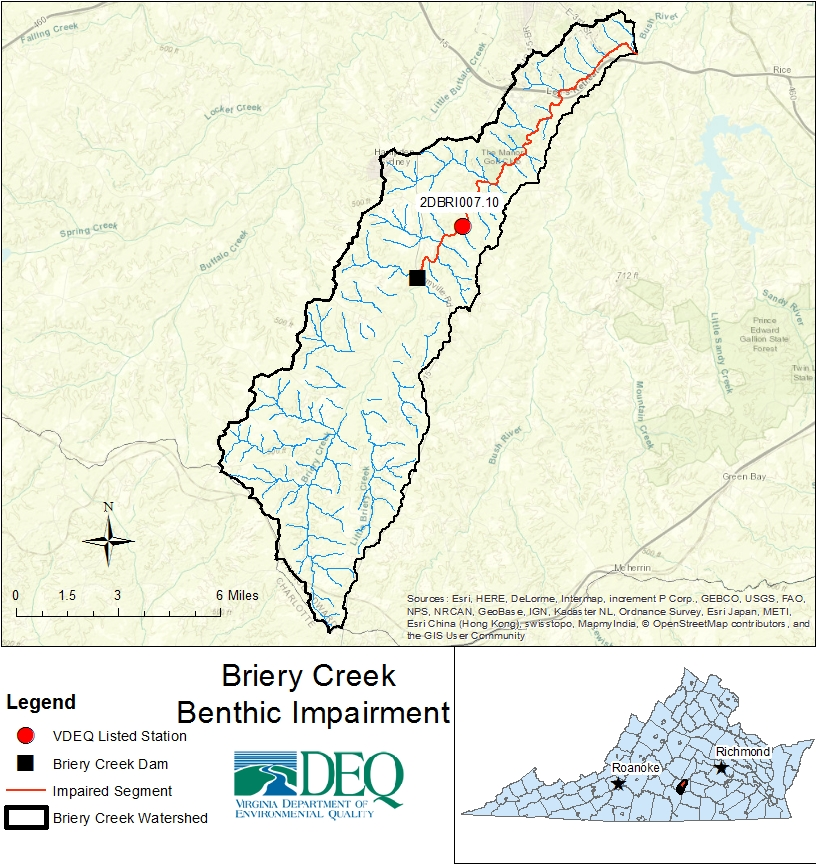
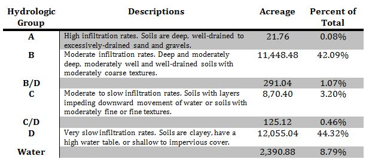
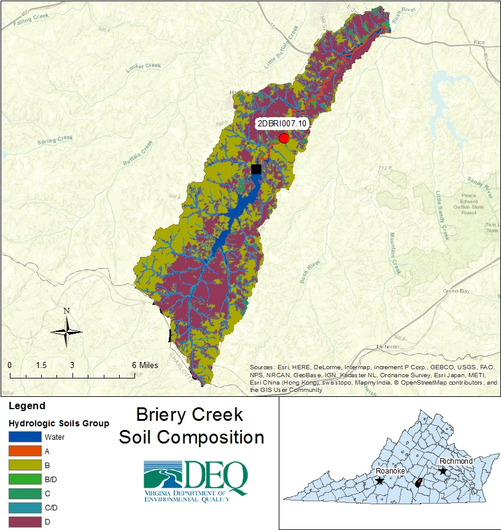
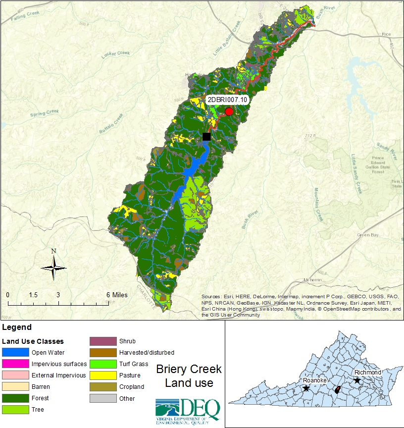
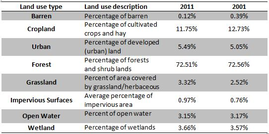
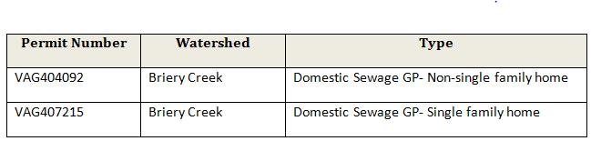
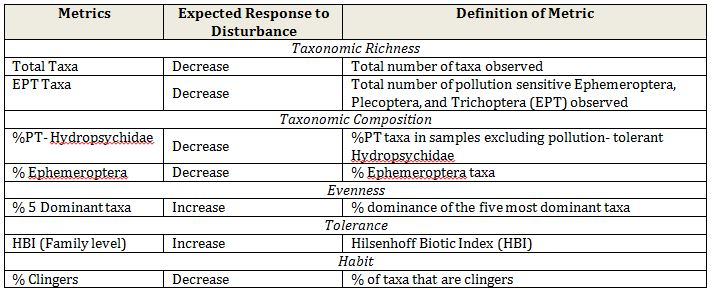
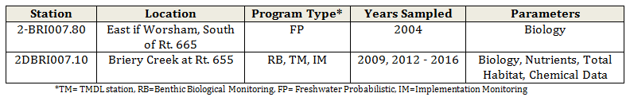
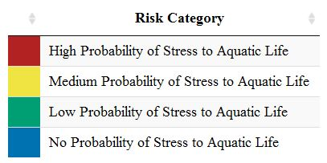

```{r setup, include= FALSE, message= FALSE}
knitr::opts_chunk$set(echo = FALSE) # This line makes sure no R chunks are displayed in the output report
# Bring in custom plotting functions
# Dummy min/maxDate object so you can build these objects outside the function
minDate <- as.Date('2000-05-01')
maxDate <- as.Date('2020-05-01')

# Build specifics for each plot by parameter
DOsettings <- list(
  annotate("rect", xmin=minDate, xmax=maxDate, ymin=10, ymax=Inf, alpha=1, fill="#0072B2") ,
  annotate("rect",xmin=minDate, xmax=maxDate, ymin=8, ymax=10, alpha=1, fill="#009E73") ,
  annotate("rect",xmin=minDate, xmax=maxDate, ymin=7, ymax=8, alpha=1, fill="#F0E442") ,
  annotate("rect",xmin=minDate, xmax=maxDate, ymin=-Inf, ymax=7, alpha=1, fill="firebrick" ) ,
  geom_hline(yintercept = 4, color="black", size=1.5),
  scale_y_continuous(name="Dissolved Oxygen (mg/L)", breaks=c(4:15), limits=c(4,15)) ,
  labs(x="Sample Month-Year", y="Dissolved Oxygen (mg/L)"))

pHsettings <- list(
  annotate("rect", xmin=minDate, xmax=maxDate, ymin=6, ymax=9, alpha=1, fill="#009E73"),
  annotate("rect",xmin=minDate, xmax=maxDate, ymin=9, ymax=Inf, alpha=1, fill="#F0E442"),
  annotate("rect",xmin=minDate, xmax=maxDate, ymin=-Inf, ymax=6, alpha=1, fill="#F0E442" ),
  geom_hline(yintercept = 6, color="black", size=1.5),
  geom_hline(yintercept = 9, color="black", size=1.5),
  scale_y_continuous(name="pH (unitless)", breaks=seq(5,10,.5), limits=c(5,10)),
  labs(x="Sample Month-Year", y="pH (unitless)"))

spCondsettings <- list(
  annotate("rect", xmin=minDate, xmax=maxDate, ymin=-Inf, ymax=250, alpha=1, fill="#0072B2"),
  annotate("rect",xmin=minDate, xmax=maxDate, ymin=250, ymax=350, alpha=1, fill="#009E73" ),
  annotate("rect",xmin=minDate, xmax=maxDate, ymin=350, ymax=500, alpha=1, fill="#F0E442"),
  annotate("rect",xmin=minDate, xmax=maxDate, ymin=500, ymax=Inf, alpha=1, fill="firebrick" ),
  scale_y_continuous(name="Specific Conductivity (uS/cm)", breaks=seq(30, 550,50),limits=c(30,550)),
  labs(x="Sample Month-Year", y="Specific Conductivity (uS/cm)"))

TDSsettings <- list(
  annotate("rect", xmin=minDate, xmax=maxDate, ymin=-Inf, ymax=100, alpha=1, fill="#0072B2"),
  annotate("rect",xmin=minDate, xmax=maxDate, ymin=100, ymax=250, alpha=1, fill="#009E73" ),
  annotate("rect",xmin=minDate, xmax=maxDate, ymin=250, ymax=350, alpha=1, fill="#F0E442"),
  annotate("rect",xmin=minDate, xmax=maxDate, ymin=350, ymax=Inf, alpha=1, fill="firebrick" ),
  scale_y_continuous(name="Total Dissolved Solids (mg/L)", breaks=seq(50, 400,50), limits=c(50,400)),
  labs(x="Sample Month-Year", y="Total Dissolved Solids (mg/L)"))

Sulfatesettings <- list(
  annotate("rect",xmin=minDate, xmax=maxDate, ymin=-Inf, ymax=10, alpha=1, fill="#0072B2"),
  annotate("rect",xmin=minDate, xmax=maxDate, ymin=10, ymax=25, alpha=1, fill="#009E73" ),
  annotate("rect",xmin=minDate, xmax=maxDate, ymin=25, ymax=75, alpha=1, fill="#F0E442"),
  annotate("rect",xmin=minDate, xmax=maxDate, ymin=75, ymax=Inf, alpha=1, fill="firebrick" ),
  scale_y_continuous(name="Dissolved Sulfate (mg/L)", breaks=seq(0, 80,10), limits=c(0,80)),
  labs(x="Sample Month-Year", y="Dissolved Sulfate (mg/L)"))

Chloridesettings <- list(
  annotate("rect",xmin=minDate, xmax=maxDate, ymin=-Inf, ymax=10, alpha=1, fill="#0072B2"),
  annotate("rect",xmin=minDate, xmax=maxDate, ymin=10, ymax=25, alpha=1, fill="#009E73" ),
  annotate("rect",xmin=minDate, xmax=maxDate, ymin=25, ymax=50, alpha=1, fill="#F0E442"),
  annotate("rect",xmin=minDate, xmax=maxDate, ymin=50, ymax=Inf, alpha=1, fill="firebrick" ),
  scale_y_continuous(name="Dissolved Chloride (mg/L)", breaks=seq(0, 55,5), limits=c(0,55)),
  labs(x="Sample Month-Year", y="Dissolved Chloride (mg/L)"))

Potassiumsettings <- list(
  annotate("rect", xmin=minDate, xmax=maxDate, ymin=-Inf, ymax=1, alpha=1, fill="#0072B2"),
  annotate("rect",xmin=minDate, xmax=maxDate, ymin=1, ymax=2, alpha=1, fill="#009E73" ),
  annotate("rect",xmin=minDate, xmax=maxDate, ymin=2, ymax=10, alpha=1, fill="#F0E442"),
  annotate("rect",xmin=minDate, xmax=maxDate, ymin=10, ymax=Inf, alpha=1, fill="firebrick" ),
  scale_y_continuous(name="Dissolved Potassium (mg/L)", breaks=seq(0, 12,2),limits=c(0,12)),
  labs(x="Sample Month-Year", y="Dissolved Potassium (mg/L)"))

Sodiumsettings <- list(
  annotate("rect",xmin=minDate, xmax=maxDate, ymin=-Inf, ymax=7, alpha=1, fill="#0072B2"),
  annotate("rect",xmin=minDate, xmax=maxDate, ymin=7, ymax=10, alpha=1, fill="#009E73" ),
  annotate("rect",xmin=minDate, xmax=maxDate, ymin=10, ymax=20, alpha=1, fill="#F0E442"),
  annotate("rect",xmin=minDate, xmax=maxDate, ymin=20, ymax=Inf, alpha=1, fill="firebrick" ),
  scale_y_continuous(name="Dissolved Sodium (mg/L)", breaks=seq(0, 30,5), limits=c(0,30)),
  labs(x="Sample Month-Year", y="Dissolved Sodium (mg/L)"))

TNsettings <- list(
  annotate("rect", xmin=minDate, xmax=maxDate, ymin=-Inf, ymax=.5, alpha=1, fill="#0072B2"),
  annotate("rect",xmin=minDate, xmax=maxDate, ymin=.5, ymax=1, alpha=1, fill="#009E73" ),
  annotate("rect",xmin=minDate, xmax=maxDate, ymin=1, ymax=2, alpha=1, fill="#F0E442"),
  annotate("rect",xmin=minDate, xmax=maxDate, ymin=2, ymax=Inf, alpha=1, fill="firebrick" ),
  scale_y_continuous(name="Total Nitrogen (mg/L)", breaks=seq(0, 3.5,.5), limits=c(0,3.5)),
  labs(x="Sample Month-Year", y="Total Nitrogen (mg/L)"))

TPsettings <- list(
  annotate("rect", xmin=minDate, xmax=maxDate, ymin=-Inf, ymax=.02, alpha=1, fill="#0072B2"),
  annotate("rect",xmin=minDate, xmax=maxDate, ymin=.02, ymax=.05, alpha=1, fill="#009E73" ),
  annotate("rect",xmin=minDate, xmax=maxDate, ymin=.05, ymax=.1, alpha=1, fill="#F0E442"),
  annotate("rect",xmin=minDate, xmax=maxDate, ymin=.1, ymax=Inf, alpha=1, fill="firebrick" ),
  scale_y_continuous(name="Total Phosphorus (mg/L)", breaks=seq(0, .2,.03),limits=c(0,0.2)),
  labs(x="Sample Month-Year", y="Total Phosphorus (mg/L)"))

TotHabsettings <- list(
  annotate("rect", xmin=minDate, xmax=maxDate, ymin=150, ymax=Inf, alpha=1, fill="#0072B2"),
  annotate("rect",xmin=minDate, xmax=maxDate, ymin=130, ymax=150, alpha=1, fill="#009E73" ),
  annotate("rect",xmin=minDate, xmax=maxDate, ymin=100, ymax=130, alpha=1, fill="#F0E442"),
  annotate("rect",xmin=minDate, xmax=maxDate, ymin=-Inf, ymax=100, alpha=1, fill="firebrick" ),
  scale_y_continuous(name="Total Habitat (unitless)", breaks=seq(0, 200, 25),limits=c(0,200)),
  labs(x="Sample Month-Year", y="Total Habitat (unitless)"))

LRBSsettings <- list(
   annotate("rect", xmin=minDate, xmax=maxDate, ymin=-Inf, ymax=-1.5, alpha=1, fill="firebrick"),
     annotate("rect",xmin=minDate, xmax=maxDate, ymin=-1.5, ymax=-1, alpha=1, fill="#F0E442"),
     annotate("rect",xmin=minDate, xmax=maxDate, ymin=-1, ymax=-0.5, alpha=1, fill="#009E73"),
     annotate("rect",xmin=minDate, xmax=maxDate, ymin=-0.5, ymax=0.5, alpha=1, fill="#0072B2"),
     annotate("rect",xmin=minDate, xmax=maxDate, ymin=0.5, ymax=Inf, alpha=1, fill="#F0E442"),
   scale_y_continuous(name="Log Relative Bed Stability (unitless)", breaks=seq(-2, 1,.5),limits=c(-2, 1)),
  labs(x="Sample Month-Year", y="Log Relative Bed Stability (unitless)"))

Tempsettings <- list(
  geom_hline(yintercept =32, color="black", size=1),
  scale_y_continuous(name="Temperature (C)", breaks=seq(0,35, 5), limits=c(0,35)),
  labs(x="Sample Month-Year", y="Temperature (C)"))

MetalsCCUsettings <- list(
  annotate("rect", xmin=minDate, xmax=maxDate, ymin=-Inf, ymax=0.75, alpha=1, fill="#0072B2"),
  annotate("rect",xmin=minDate, xmax=maxDate, ymin=0.75, ymax=1.5, alpha=1, fill="#009E73" ),
  annotate("rect",xmin=minDate, xmax=maxDate, ymin=1.5, ymax=2.0, alpha=1, fill="#F0E442"),
  annotate("rect",xmin=minDate, xmax=maxDate, ymin=2.0, ymax=Inf, alpha=1, fill="firebrick" ),
  scale_y_continuous(name="Metals CCU (unitless)", breaks=seq(0, 2.5,0.25),limits=c(0,2.5)),
  labs(x="Sample Month-Year", y="Metals CCU (unitless)"))


gMasterPlot <- function(dataset,parameter, datebreaks){
  dat <- dplyr::select(dataset,StationID,date,prettyDate,parameter) %>% # Subset parameter of interest from whole dataset
    dplyr::rename(parameter2=!!names(.[4])) %>% # sneaky rename so ggplot will play nicely in function with changeable parameter variable
    filter(!is.na(parameter2)) # Remove samples without parameter measurements
 
  # output plot if there is data, if not tell user
  if(nrow(dat)==0){
    return(print("No data for that parameter in the input dataset."))
  }else{
    
    # Find min and max dates based on dataset to use for annotation rectangle limits in ggplot
    minDate <- min(dat$date)-15
    maxDate <- max(dat$date)+15
    
    if(parameter== 'DO'){specialSettings <- DOsettings}
    if(parameter=='pH'){specialSettings <- pHsettings}
    if(parameter=='SpCond'){specialSettings <- spCondsettings}
    if(parameter=='TDS'){specialSettings <- TDSsettings}
    if(parameter=='DSulfate'){specialSettings <- Sulfatesettings}
    if(parameter=='DChloride'){specialSettings <- Chloridesettings}
    if(parameter=='DPotassium'){specialSettings <- Potassiumsettings}
    if(parameter=='DSodium'){specialSettings <- Sodiumsettings}
    if(parameter=='TN'){specialSettings <- TNsettings}
    if(parameter=='TP'){specialSettings <- TPsettings}
    if(parameter=='TotalHabitat'){specialSettings <- TotHabsettings}
    if(parameter=='LRBS'){specialSettings <- LRBSsettings}
    if(parameter=='Temp'){specialSettings <- Tempsettings}
    if(parameter=='MetalsCCU'){specialSettings <- MetalsCCUsettings}
    if(parameter=='VCPMI'){specialSettings <-VCPMIsettings}
    
   # Adjust plot limits if data are outside specialSettings preset range
    if(max(dat$parameter2) >= specialSettings[[length(specialSettings)-1]][['limits']][2]){
      specialSettings[[length(specialSettings)-1]][['limits']][2] <- signif(max(dat$parameter2)*1.15,2)
      specialSettings[[length(specialSettings)-1]][['breaks']] <- signif(seq(min(specialSettings[[length(specialSettings)-1]][['breaks']]),
                                                                             specialSettings[[length(specialSettings)-1]][['limits']][2],length.out=10),2)}
 
    
    # Now make the plot
    p <- ggplot(dat, aes(x=date, y=parameter2, group=StationID)) + 
      theme(axis.text=element_text(size=14, face="bold"), legend.text=element_text(size=14),legend.title =   element_text(size=14, face="bold"),axis.title=element_text(size=14, face="bold")) +
      scale_x_date(date_breaks = datebreaks, date_labels =  "%b-%y") + 
      coord_cartesian(xlim = as.Date(c(maxDate, minDate))) +
      theme(axis.text.x=element_text(angle=45,hjust=1)) +  
      
      specialSettings + 
      
      geom_point(aes(fill=StationID),colour='black',shape=21, size=6) +
      scale_fill_manual(values=gray.colors(length(unique(dat$StationID))))+  # have different point options depending on number of stations
      guides(fill=guide_legend(title="Station ID"))
    
    return(p)
  }
}


# Risk table
riskHightoLow <- c('High Probability of Stress to Aquatic Life','Medium Probability of Stress to Aquatic Life','Low Probability of Stress to Aquatic Life','No Probability of Stress to Aquatic Life')
risk <- data.frame(Risk_Category=c('High Probability of Stress to Aquatic Life','Medium Probability of Stress to Aquatic Life','Low Probability of Stress to Aquatic Life','No Probability of Stress to Aquatic Life'))
brksrisk <- c('High Probability of Stress to Aquatic Life','Medium Probability of Stress to Aquatic Life','Low Probability of Stress to Aquatic Life','No Probability of Stress to Aquatic Life')
clrsrisk <- c("firebrick","#F0E442","#009E73","#0072B2")

# Each parameter risk table and colors
pHRiskTable <- list(
  Data = data.frame(Risk_Category=c('Medium Probability of Stress to Aquatic Life','Low Probability of Stress to Aquatic Life','Medium Probability of Stress to Aquatic Life'),pH=c("< 6","6 - 9","> 9")),
  ColNames = c('Risk Category','pH (unitless)'),
  StyleEqual1 = c('Medium Probability of Stress to Aquatic Life','Low Probability of Stress to Aquatic Life'),
  StyleEqual2 = c('#F0E442','#009E73'),
  brks = c(0,6,9),
  clrs = c("gray","#F0E442","#009E73","#F0E442")
)

DORiskTable <- list(
  Data = cbind(risk,DO=c('< 7','> 7, < 8','> 8, < 10','> 10')),
  ColNames = c('Risk Category','DO (mg/L)'),
  StyleEqual1 = riskHightoLow,
  StyleEqual2 = c("firebrick","#F0E442","#009E73","#0072B2"),
  brks = c(0,7,8,10),
  clrs = c("gray","firebrick","#F0E442","#009E73","#0072B2")
)

TNRiskTable <- list(
  Data = cbind(risk,TN=c('> 2','> 1, < 2','> 0.5, < 1','< 0.5')),
  ColNames = c('Risk Category','Total Nitrogen (mg/L)'),
  StyleEqual1 = riskHightoLow,
  StyleEqual2 = c("firebrick","#F0E442","#009E73","#0072B2"),
  brks = c(0,0.5,1,2),
  clrs = c("gray","#0072B2","#009E73","#F0E442","firebrick")
)

TPRiskTable <- list(
  Data = cbind(risk,TP=c('> 0.1','> 0.05, < 0.1','> 0.02, < 0.05','< 0.02')),
  ColNames = c('Risk Category','Total Phosphorus (mg/L)'),
  StyleEqual1 = riskHightoLow,
  StyleEqual2 = c("firebrick","#F0E442","#009E73","#0072B2"),
  brks = c(0,0.02,0.05,0.1),
  clrs = c("gray","#0072B2","#009E73","#F0E442","firebrick")
)

TotHabRiskTable <- list(
  Data = cbind(risk,TotalHabitat=c('< 100','> 100, < 130','> 130, < 150','> 150')),
  ColNames = c('Risk Category','Total Habitat (unitless)'),
  StyleEqual1 = riskHightoLow,
  StyleEqual2 = c("firebrick","#F0E442","#009E73","#0072B2"),
  brks = c(0,100,130,150),
  clrs = c("gray","firebrick","#F0E442","#009E73","#0072B2")
)

LRBSRiskTable <- list(
  Data = cbind(rbind(risk,'Medium Probability of Stress to Aquatic Life'),LRBS=c('< -1.5','> -1.5, < -1.0','> -0.5, < -1.0','> -0.5, < 0.5','> 0.5')),
  ColNames = c('Risk Category','Relative Bed Stability (unitless)'),
  StyleEqual1 = c(riskHightoLow,'Medium Probability of Stress to Aquatic Life'),
  StyleEqual2 = c("firebrick","#F0E442","#009E73","#0072B2","#F0E442"),
  brks = c(-3,-1.5,-1,-0.5,0.5),
  clrs = c("gray","firebrick","#F0E442","#009E73","#0072B2","#F0E442")
)

MetalsCCURiskTable <- list(
  Data = cbind(risk,MetalsCCU=c('> 2.0','> 1.5, < 2.0','> 0.75, < 1.5','< 0.75')),
  ColNames = c('Risk Category','Metals CCU (unitless)'),
  StyleEqual1 = riskHightoLow,
  StyleEqual2 = c("firebrick","#F0E442","#009E73","#0072B2"),
  brks = c(0,0.75,1.5,2.0),
  clrs = c("gray","#0072B2","#009E73","#F0E442","firebrick")
)

SpCondRiskTable <- list(
  Data = cbind(risk,SpCond=c('> 500','> 350, < 500','> 250, < 350','< 250')),
  ColNames = c('Risk Category','Specific Conductivity (uS/cm)'),
  StyleEqual1 = riskHightoLow,
  StyleEqual2 = c("firebrick","#F0E442","#009E73","#0072B2"),
  brks = c(0,250,350,500),
  clrs = c("gray","#0072B2","#009E73","#F0E442","firebrick")
)

TDSRiskTable <- list(
  Data = cbind(risk,TDS=c('> 350','> 250, < 350','> 100, < 250','< 100')),
  ColNames = c('Risk Category','Total Dissolved Solids (mg/L)'),
  StyleEqual1 = riskHightoLow,
  StyleEqual2 = c("firebrick","#F0E442","#009E73","#0072B2"),
  brks =  c(0,100,250,350),
  clrs = c("gray","#0072B2","#009E73","#F0E442","firebrick")
)

DSulfateRiskTable <- list(
  Data = cbind(risk,DSulfate=c('> 75','> 25, < 75','> 10, < 25','< 10')),
  ColNames = c('Risk Category','Dissolved Sulfate (mg/L)'),
  StyleEqual1 = riskHightoLow,
  StyleEqual2 = c("firebrick","#F0E442","#009E73","#0072B2"),
  brks = c(0,10,25,75),
  clrs = c("gray","#0072B2","#009E73","#F0E442","firebrick")
)

DChlorideRiskTable <- list(
  Data = cbind(risk,DChloride=c('> 50','> 25, < 50','> 10, < 25','< 10')),
  ColNames = c('Risk Category','Dissolved Chloride (mg/L)'),
  StyleEqual1 = riskHightoLow,
  StyleEqual2 = c("firebrick","#F0E442","#009E73","#0072B2"),
  brks =  c(0,10,25,50),
  clrs = c("gray","#0072B2","#009E73","#F0E442","firebrick")
)

DPotassiumRiskTable <- list(
  Data = cbind(risk,DPotassium=c('> 10','> 2, < 10','> 1, < 2','< 1')),
  ColNames = c('Risk Category','Dissolved Potassium (mg/L)'),
  StyleEqual1 = riskHightoLow,
  StyleEqual2 = c("firebrick","#F0E442","#009E73","#0072B2"),
  brks = c(0,1,2,10),
  clrs = c("gray","#0072B2","#009E73","#F0E442","firebrick")
)

DSodiumRiskTable <- list(
  Data = cbind(risk,DSodium=c('> 20','> 10, < 20','> 7, < 10','< 7')),
  ColNames = c('Risk Category','Dissolved Sodium (mg/L)'),
  StyleEqual1 = riskHightoLow,
  StyleEqual2 = c("firebrick","#F0E442","#009E73","#0072B2"),
  brks =  c(0,7,10,20),
  clrs = c("gray","#0072B2","#009E73","#F0E442","firebrick")
)


# Only report 2 decimal places
options(digits=2)
```

```{r readInData,message=FALSE}
# Read in datasets
stats <- params[['userDataRMD']][['stats']]
envData <- params[['userDataRMD']][['stats_wTemp']]
bugData <- params[['userDataRMD']][['bugData']] %>%
  dplyr::rename("VCPMI"="CPMI63+CHOWAN")
habData <- params[['userDataRMD']][['habitatData']]

prettyStreamName <-  params[['userDataRMD']][['prettyStreamName']] 
```

```{r, message=FALSE, eval=FALSE}
# Read in datasets
#stats <- read.csv('C:/HardDriveBackup/R/ShinyApp_TMDLworkgroup/BenthicStressorTool/testData/7-PAR003.09/CompositeTable_2018-04-307-PAR003.09.csv')
#envData <- read.csv('C:/HardDriveBackup/R/ShinyApp_TMDLworkgroup/BenthicStressorTool/testData/7-PAR003.09/LOGImanipulatedData_2018-04-277-PAR003.09.csv')
#bugData <- read_excel('C:/HardDriveBackup/R/ShinyApp_TMDLworkgroup/BenthicStressorTool/testData/7-PAR003.09/Family Metrics VCPMI63+Chowan_MRD_7-PAR003.09.xlsx') %>%
#  dplyr::rename("VCPMI"="CPMI63+CHOWAN")
#habData <- read_excel('C:/HardDriveBackup/R/ShinyApp_TMDLworkgroup/BenthicStressorTool/testData/7-PAR003.09/Habitat parameters Query LB_7-PAR003.09.xlsx')

#prettyStreamName <-  'Parker Creek'
```


```{r dataManipulation, message=FALSE}
# catch for wonky dates coming in from Lucy
if(sum(grep("/",envData$CollectionDateTime))){
  envData$CollectionDateTime <- as.Date(as.character(envData$CollectionDateTime),format='%m/%d/%Y')
}

# Adjust season to factor for plotting purposes
bugData <- mutate(bugData, SampleSeason=paste(ifelse(format(bugData$CollDate,format="%m") %in% c('01','02','03','04','05','06'),'Spring','Fall'),format(bugData$CollDate,format="%Y")))
bugData$SampleSeason <- factor(bugData$SampleSeason, levels=unique(as.character(bugData$SampleSeason)) )

# Date adjusments for biological data
bioDates <- filter(envData, !is.na(TotalHabitat) | !is.na(LRBS))%>% #Create DF of data where Total Hab or LRBS is not NA (i.e. biological data samples)
  mutate(noTime=CollectionDateTime) # add column "noTime" that has the date but no time for prettier plots
monDateTime <- filter(envData, is.na(TotalHabitat) & is.na(LRBS))%>%    # Create a new DF of data where Total Hab & LRBS is NA (i.e water mon data)
  mutate(noTime = gsub( " .*$", "", as.character(CollectionDateTime))) # add column "noTime" that has the date but no time for prettier plots

envDataPlots <- rbind(bioDates,monDateTime)%>% #Combine two dataframes 
  mutate(date= as.Date(as.character(noTime),format = "%Y-%m-%d"),#Change format to month and year
         prettyDate=format(date, format="%B %Y"))

```

#1.0 Introduction

&nbsp;&nbsp;&nbsp;&nbsp;&nbsp;&nbsp;The Clean Water Act (CWA) requires that waters in the United States support recreation, swimming & boating, wildlife, aquatic life, fish and shellfish. In order to meet the requirements of the CWA, Virginia has adopted water quality standards (WQS) and assess water quality monitoring data to determine if waterbodies are meeting the WQS.  Waterbodies not meeting standards, i.e. impaired waterbodies, are reported in the Virginia Department of Environmental Quality's (VADEQ) biennial Integrated Assessment on Virginia's 303(d) Impaired Waters List or "dirty waters list".  

&nbsp;&nbsp;&nbsp;&nbsp;&nbsp;&nbsp;`r prettyStreamName` is located in ~~Prince Edward County and drains 42.5 square miles of mostly forested and pasture land. It is a tributary to the Bush River, which feeds the Appomattox River. The Appomattox River eventually joins the James River and enters the Chesapeake Bay.  Approximately 10.48 miles of Briery Creek is considered impaired for the Aquatic Life Use WQS, meaning there is not a healthy and diverse community of aquatic macroinvertebrates.  Briery Creek is impaired from the Briery Lake to its confluence with the Bush River.~~  

&nbsp;&nbsp;&nbsp;&nbsp;&nbsp;&nbsp;The goal of this report is to determine the causes of the biological impairment in `r prettyStreamName` through a stressor analysis process. The stressor analysis process is a weight-of-evidence approach provided by monitoring data and scientific literature, which attempts to identify the most likely stressors to the biological community, i.e. the causes of the biological impairment.  

##1.1 Applicable Water Quality Standards

&nbsp;&nbsp;&nbsp;&nbsp;&nbsp;&nbsp;Virginia's WQSs consist of water quality criteria that protect the designated uses of all Virginia waterbodies. According to Virginia water quality standards ([9 VAC 25-260-10][VAC2526010]) : 

&nbsp;&nbsp;&nbsp;&nbsp;&nbsp;&nbsp;"All state waters, including wetlands, are designated for the following uses:   
&nbsp;&nbsp;&nbsp;&nbsp;&nbsp;&nbsp;recreational uses, e.g., swimming and boating; the propagation and growth of a  
&nbsp;&nbsp;&nbsp;&nbsp;&nbsp;&nbsp;balanced, indigenous population of aquatic life, including game fish, which might  
&nbsp;&nbsp;&nbsp;&nbsp;&nbsp;&nbsp;reasonably be expected to inhabit them; wildlife; and the production of  
&nbsp;&nbsp;&nbsp;&nbsp;&nbsp;&nbsp;edible and marketable natural resources, e.g., fish and shellfish."  

Water quality criteria can be numerical or narrative. The General Standard defined in Virginia's water quality standards ([9 VAC 25-260-20][VAC2526020]) provides general, narrative criteria for the protection of designated uses from substances that may interfere with attainment of such uses. The General Standards states:  

&nbsp;&nbsp;&nbsp;&nbsp;&nbsp;&nbsp;"State waters, including wetlands, shall be free from substances attributable  
&nbsp;&nbsp;&nbsp;&nbsp;&nbsp;&nbsp;to sewage, industrial waste, or other waste in concentrations, amounts, or  
&nbsp;&nbsp;&nbsp;&nbsp;&nbsp;&nbsp;combinations which contravene established standards or interfere directly or  
&nbsp;&nbsp;&nbsp;&nbsp;&nbsp;&nbsp;indirectly with designated uses of such water or which are inimical or harmful  
&nbsp;&nbsp;&nbsp;&nbsp;&nbsp;&nbsp;to human, animal, plant, or aquatic life."  

&nbsp;&nbsp;&nbsp;&nbsp;&nbsp;&nbsp;A biological impairment in Virginia is based on the biological monitoring and assessment of benthic macroinvertebrate communities. Biomonitoring allows VADEQ to assess the overall ecological condition of streams and rivers by evaluating suitability for support of aquatic communities. In Virginia, benthic macroinvertebrate communities are used as indicators of ecological condition and are one way to determine support for the aquatic life designated use.  

&nbsp;&nbsp;&nbsp;&nbsp;&nbsp;&nbsp;A multi-metric macroinvertebrate index, the Virginia Coastal Plain Macroinvertebrate Index (VCPMI), is used to assess the aquatic life use status for wadeable freshwater streams and rivers in coastal areas of the state, specifically within EPA ecoregion (Level III) 63 and the Chowan basin. VCPMI scores range from 0 to 100, with higher scores indicating relatively better ecological health. VADEQ has set a score of 40 as the threshold for impairment. Scores below 40 indicate an impaired biological community, while scores above 40 indicate a healthy biological community.  

##1.2 Impairment Listing
&nbsp;&nbsp;&nbsp;&nbsp;&nbsp;&nbsp;`r prettyStreamName` was first listed on Virginia's 303(d) Report in ~~2008 for an aquatic life use impairment based on biomonitoring in 2004 for DEQ's probabilistic monitoring program. Since that time, several samples have been collected along the impaired reach to confirm the aquatic life use impairment.  Briery Creek is impaired from Briery Creek Lake to its confluence with Bush River. The same segment of Briery Creek is also listed on the 303(d) report for a bacteria impairment; however, the Appomattox bacterial TMDL was completed in 2004 to address this impairment.  DEQ has conducted follow-up monitoring in preparation for the stressor identification process.~~  

#2.0 Watershed Characterization
&nbsp;&nbsp;&nbsp;&nbsp;&nbsp;&nbsp;~~The physical characteristics of the Briery Creek watershed were calculated using Geographic Information Systems. Land use/cover, soil characteristics, topography, and existing permits within the Briery Creek watershed are described below because they are important for understanding any potential impacts to aquatic life.      
&nbsp;&nbsp;&nbsp;&nbsp;&nbsp;&nbsp;Briery Creek drains 27,200 acres of land in Prince Edward County, VA (Figure 1). From its headwaters to the confluence with Bush River, Briery Creek flows for approximately 22 miles and about 17 of those miles are considered free-flowing water. The Briery Creek watershed is mostly forested but has experienced historical agriculture and logging activities. All of the Briery Creek watershed is located in the Piedmont ecoregion which is often characterized by clay-like soils that are susceptible to erosion due to heavy historical farming.  
&nbsp;&nbsp;&nbsp;&nbsp;&nbsp;&nbsp;Briery Creek Lake is an 845-acre lake, located about 6 miles downstream of its Briery Creek's headwaters. The lake was formed by damming Briery Creek and Little Briery Creek in 1989. Briery Creek Lake is known for its recreational uses, particularly bass fishing. The ample timber stocks and vegetation in Briery Creek Lake are ideal habitat for fish. Surrounding the lake is a 3,164-acre wildlife management area that was historically used for tobacco farming. This area is now mostly forested land with some logging activities. The dam is owned and managed by the Virginia Department of Game and Inland Fisheries since its construction.~~



##2.1 Topography
&nbsp;&nbsp;&nbsp;&nbsp;&nbsp;&nbsp;~~Elevation was calculated in the USGS StreamStats application using a National Elevation Dataset (NED). The Briery Creek watershed elevation ranged between 288.43 to 641.6 feet above mean sea level, with an elevation average of 465.34 feet.~~

##2.1 Soils
&nbsp;&nbsp;&nbsp;&nbsp;&nbsp;&nbsp;~~Composition of hydrologic soil groups were descried in the Briery Creek watershed using the Soil Survey Geographic (SSURGO) database (NCRS, 2015). Hydrologic soil groups represent the infiltration characteristics of soils, where a Group “A” represents soils that have high infiltration rates and Group “D” represents soils that have slow infiltration rates. Soils that have slower infiltration rates are more susceptible to greater erosion rates because rainwater will runoff the land quicker instead of infiltrating.  The soil in the Briery Creek watershed was comprised of mostly group “B” (42.09%)  and “D” (44.32%) soils that are described as having moderate infiltration rates and very slow infiltration rates, respectively (Table 1 & Figure 2).~~




##2.3 Landuse

&nbsp;&nbsp;&nbsp;&nbsp;&nbsp;&nbsp;~~The National Land Cover Dataset (NLCD, 2011) was used to calculate land use in the Briery Creek watershed (Figure 3). Land cover data from 2001 was also used to estimate land use changes within a 10-year period. The Briery Creek watershed is approximately 73% forest, 12% cropland, and 6% urban (Table 2). When compared to land use data from 2001, we found that there was very little change in the percent of forested area but the percent cropland decreased and percent urban increased slightly.~~  






##2.4 Permitted Facilities
&nbsp;&nbsp;&nbsp;&nbsp;&nbsp;&nbsp;~~There are two domestic sewage permits within the Briery Creek watershed (Table 3).~~  


#3.0 Biological and Water Quality Data Inventory

##3.1 Biological Monitoring
&nbsp;&nbsp;&nbsp;&nbsp;&nbsp;&nbsp;Benthic macroinvertebrate communities reflect the water and habitat quality in a stream over a longer period of time compared to ambient water samples that capture water quality at a single point in time. Therefore, the VADEQ evaluates biological communities to assess whether chronic and/or acute stressors are negatively affecting stream resources or habitat that result in biological communities with low diversity and mainly tolerant organisms. Biological communities are evaluated as impaired or non-impaired using the Virginia Coastal Plain Macroinvertebrate Index (VCPMI) scores, which account for the number and type of organisms in an aquatic community (Table 4). A VCPMI score greater than 40 is considered non-impaired and a score of less than or equal to 40 indicates an impaired stream (VADEQ, 2013).



&nbsp;&nbsp;&nbsp;&nbsp;&nbsp;&nbsp;The macroinvertebrate community in `r prettyStreamName` is impaired for ~~10.42 miles, from the Briery Creek Lake Dam to the confluence with the Bush River~~. Typically `r prettyStreamName`'s VCPMI score has been `r ifelse(median(bugData$VCPMI, na.rm=TRUE) > 40,'above','below')` the impairment threshold with a median value of `r median(bugData$VCPMI, na.rm=TRUE)` (Figure 4). On average, fall samples had a `r ifelse(mean(bugData[grep('Fall',bugData$SampleSeason),]$VCPMI,na.rm=T) > mean(bugData[grep('Spring',bugData$SampleSeason),]$VCPMI,na.rm=T),'higher','lower')` VCPMI score (`r mean(bugData[grep('Fall',bugData$SampleSeason),]$VCPMI,na.rm=T)`) compared to spring samples (`r mean(bugData[grep('Spring',bugData$SampleSeason),]$VCPMI,na.rm=T)`). ~~The discrepancy is due to the low % Ephemeroptera taxa found in spring samples. However, in both seasons low VCPMI scores were driven primarily by % Ephemeroptera, % Plecoptera and Trichoptera excluding Hydropsychidae, and % scraper scores (Table 5). Generally, Hydropsychidae, a sensitive caddisfly, was the most dominate taxa in all samples across all years. A scraping mayfly, Heptageniidae was the most common Ephemeroptera taxon.~~  


```{r , echo=FALSE,message=FALSE, fig.width=10, fig.height=4, fig.cap=paste("Figure 4: Virginia Coastal Plain Macroinvertebrate Index (VCPMI) for ", prettyStreamName,". A score of less than or equal to  40 indicates an impaired benthic community. No replicate samples are represented in the dataset. If more than one sample was present in a sample season, they are colored gray and noted in the legend.",sep="")}
bugData2 <- select(bugData, SampleSeason, VCPMI)

# make new factor level if two fall/spring samples (Rep 1's) in the same season and year 
if(any(duplicated(bugData2$SampleSeason))){  
  bugData_1 <- bugData2[!duplicated(bugData2$SampleSeason), ]
  bugData_1$Sample <- 1
  bugData_2 <- bugData2[duplicated(bugData2$SampleSeason), ]
  bugData_2$Sample <- 2
  bugData2 <- rbind(bugData_1,bugData_2)
  bugData2$Sample <- as.factor(bugData2$Sample)
}else{
  bugData2$Sample <- 1
  bugData2$Sample <- as.factor(bugData2$Sample)
}


ggplot(bugData2, aes(x=SampleSeason, y=VCPMI, fill = Sample))+
  geom_bar(stat="identity", width = 0.5, position='dodge')+
  scale_fill_manual("Sample", values = c("1" = "black", "2" = "gray"))+
  labs(x="Sample Season", y="VCPMI")+
  theme(axis.text=element_text(size=14, face="bold"), legend.text=element_text(size=14),
        legend.title =   element_text(size=14, face="bold"),
        axis.title=element_text(size=14, face="bold")) +
  scale_y_continuous(name="VCPMI", breaks=seq(0, 100, 10),limits=c(0,100))+
  geom_hline(yintercept=40, color="red", size=1)+
  theme(axis.text.x=element_text(angle=45,hjust=1))

```


```{r metricScores, echo=FALSE,message=FALSE, fig.width=10, fig.height=4, fig.cap=paste("Table 5: Metric scores used to calculate the VCPMI for ", prettyStreamName,". Orange shaded values indicate the two lowest scores that are most likely driving low VCPMI scores. Red VCPMI scores are below the impairment threshold of 40.",sep="")}
bugScores <- select(bugData, SampleSeason,RichnessFinal,EPTFinal,EPHEM,`PT-H`,HBIFinal,Pct5DOM,
                    `PctClng-HS`,`VCPMI`)

bugScores[1:nrow(bugScores),2:9]%>% 
  datatable(rownames =  as.character(bugScores$SampleSeason),
            colnames = c("Total Taxa","EPT Taxa"," % Ephemeroptera"," % PT-Hydropsychid",
            "HBI","% 5 Dominant Taxa","% Clingers - Hydropsychidae + Simuliidae","VCPMI"),
            options=list(dom= 't',
                         rowCallback = # the data.length-1) part makes it only calculate each column but VCPMI
                           JS('function(row, data) {
                               var num_data = data.slice(1,data.length-1)
                               num_data.sort(function (a, b) {  return a - b;  });
                               for(i=1;i < data.length; i++) {
                               if(data[i]==num_data[num_data.length-1]) {
                               $("td:eq("+i+")", row).css("background-color", "none")
                               } else if(data[i]==num_data[0]) {
                               $("td:eq("+i+")", row).css("background-color", "orange")
                               } else if(data[i]==num_data[1]) {
                               $("td:eq("+i+")", row).css("background-color", "orange")
                               }}}')
                         )) %>% 
  formatStyle("VCPMI", backgroundColor = "lightgray", color=styleInterval(c(40),c('red','black')),
              fontWeight = styleInterval(c(40),c('bold','normal'))) %>% 
  formatRound(c('RichnessFinal','EPTFinal','EPHEM','PT-H','HBIFinal','Pct5DOM',
                    'PctClng-HS','VCPMI'), 2)


```

##3.2 Ambient Water Quality Data
&nbsp;&nbsp;&nbsp;&nbsp;&nbsp;&nbsp;In order to investigate the stressor causing the impairment to the aquatic community, all available DEQ bioassessment, ambient water quality and special study data were examined.  Biological and probabilistic sampling typically occur during low flow to capture colonized aquatic communities. Ambient water quality monitoring occurs monthly or bimonthly but is most likely during base or low flow given the infrequency and safety associated with storm sampling. Based on DEQ's water monitoring program, the observed data may be biased toward low/base flow conditions and may not accurately represent conditions at high flow.  

&nbsp;&nbsp;&nbsp;&nbsp;&nbsp;&nbsp;~~Briery Creek station 2-BRI007.80  was listed as impaired for the General Standard (benthic) in 2004 based on samples taken for the probabilistic monitoring program. Data has not been collected at this station since 2004. Biological monitoring resumed on `r prettyStreamName`, XXXXX in 2009. Additional ambient and biological monitoring were conducted in 2013, 2014, 2015, and 2016 in preparation for this study (Table 6).~~ ***User should create table similar to example table shown below for their data needs***




#4.0 Stressor Identification  
&nbsp;&nbsp;&nbsp;&nbsp;&nbsp;&nbsp;In order to develop a TMDL for a benthic impairment, a pollutant must be identified as a probable or most probable stressor to the aquatic community. A stressor can have direct effects on the organism itself, like dissolved metals or toxic chemicals, or alter habitat and resources resulting in a shift in the macroinvertebrate community. The macroinvertebrate community is comprised of a suite of organisms that are adapted to withstand the environmental conditions. As those environmental conditions change, organisms that are not adapted to those changes will be reduced in numbers or extirpated and the macroinvertebrate community will shift to organisms that can withstand the environmental conditions. The goal of the stressor analysis process is to apply a weight-of-evidence approach to define a/the most probable stressor(s) that explain(s) the shift in the benthic macroinvertebrate community.  Candidate stressors were identified based on DEQ monitoring data and known effects of pollutants on macroinvertebrates. The candidate stressors include pH, dissolved oxygen, dissolved metals, specific conductivity, total nitrogen, temperature, toxic organic chemicals, organic matter, total phosphorus, and sediment. Each stressor was categorized as non-stressor, possible stressor, or probable stressor using a weight-of-evidence approach. For applicable parameters, the "Stressor Analysis in Virginia: Data Collection and Stressor Thresholds" document published by VADEQ in 2017 ([VADEQ, 2017][stressorDoc]) was used. Figure 5 shows the stressor analysis categories.





&nbsp;&nbsp;&nbsp;&nbsp;&nbsp;&nbsp;Data collected through VADEQ's Freshwater Probabilistic Monitoring Program were used to develop stressor thresholds or concentration/measured ranges linked to probable stress to aquatic life. The stressor thresholds are not derived from literature values and are not intended to replace water quality criteria or define TMDL endpoints. The probabilistic approach minimizes bias because it is a statistically designed study and sample sites are selected randomly across a geographical area. The probabilistic monitoring dataset allowed VADEQ to determine thresholds ranging from no stress to aquatic life to high probability of stress to aquatic life for the following parameters: dissolved oxygen, pH, total phosphorus, total nitrogen, ionic strength (specific conductivity, TDS, and dissolved sulfate, chloride, sodium, and potassium), dissolved metals cumulative criterion unit, total habitat and relative bed stability.  The stress categories were developed by analyzing benthic macroinvertebrate community responses (represented by VSCI scores) through a variety of peer-reviewed statistical techniques: relative risk, relative extent, conditional probability and quantile regression. For the analysis, VCPMI scores were converted to VSCI scores, so all thresholds are applicable to an approriate VCPMI biological response. The results were interpreted into stress categories. Specifically, "No Stress to Aquatic Life" means that a parameter range reflects an undisturbed, or background, condition in Virginia. "Low Probability of Stress to Aquatic Life" represents a benthic macroinvertebrate community response that is slightly above background conditions but unlikely to cause a major community shift. The next category is "Medium Probability of Stress to Aquatic Life" and means there is evidence of harm causing a possible shift in benthic communities with changes noticeably above background conditions. The "High Probability of Stress to Aquatic Life" threshold corresponds to values that are among the highest in the Commonwealth and result in degradation of the benthic community (VADEQ, 2017).

Candidate Stressors include: 

&nbsp;&nbsp;&nbsp;&nbsp;&nbsp;&nbsp; **pH** is a measure of the hydrogen ion (H + ) concentration in an aqueous solution, with acids encompassing lower pH measurements (< 7) and bases or alkalis encompassing the higher end of the scale (> 7). pH levels control the solubility of chemicals in water, thus pH has great bearing on nutrient availability. Benthic macroinvertebrates require as specific pH range to thrive in aquatic systems. ~~Virginia Class III water quality standards identify the acceptable pH as between 6.0 and 9.0~~ ([9VAC25-260-50][VAC2526050]). 

&nbsp;&nbsp;&nbsp;&nbsp;&nbsp;&nbsp; Most organisms require oxygen to sustain life. The amount of oxygen available to aquatic organisms is called **dissolved oxygen (DO)**. Healthy aquatic organisms require high levels of DO, while more tolerant organisms can withstand lower levels. The Hilsenhoff Biotic Index (HBI), calculates the health of a stream based on the abundance of organisms and their tolerance to low dissolved oxygen. ~~Virginia Class III WQSs identify the minimum level of DO as 4.0 mg/L with a daily average no less than 5.0 mg/L ([9VAC25-260-50][VAC2526050]).~~

&nbsp;&nbsp;&nbsp;&nbsp;&nbsp;&nbsp; The **Metal Cumulative Criterion Unit (Metals CCU)** is a measurement that accounts for the additive effect of metals in the water column by standardizing each dissolved metal's concentration with chronic criterion values established by VADEQ. Arsenic, Chromium, Copper, Lead, Nickel, and Zinc are included in the calculation of the metals CCU index. Most of these metals are dependent on the water hardness; therefore, hardness was also included in the calculation. Though trace amounts of heavy metals are essential to certain metabolic functions, exceeding said quantities can prove toxic to organisms.  Aquatic insects are especially sensitive to the presence of some metals and accumulation of these metals can transfer up the food chain and biomagnify in organisms of higher trophic levels. 

&nbsp;&nbsp;&nbsp;&nbsp;&nbsp;&nbsp;**Specific conductance** is a measure of how well water can conduct an electrical current based on the amount of ions in water. Regional geology has great bearing on the ionic strength of a water body. Therefore, water flowing through materials that easily dissolve into their ionic constituents will most likely have a higher conductivity. Anthropogenic activities such as runoff from urban, agricultural, or mining areas often result in elevated conductivity. Unnatural levels of dissolved ions can stress aquatic communities that rely on a certain level of ionic strength to perform metabolic functions. 

&nbsp;&nbsp;&nbsp;&nbsp;&nbsp;&nbsp;**Total dissolved solids (TDS)** is a measurement of the amount of dissolved ions in a waterbody. Although there are no water quality standards for TDS, EPA Secondary Regulations establish a (non-enforceable) TDS level of 500 mg/L for aesthetic and corrosion prevention purposes (40 CFR 141.208). Although a TDS level of above 350 mg/L is considered to have a high probability of aquatic stress in Virginia, there are streams with naturally high levels of TDS from under-lying geology. However, analyzing a suite of ions that are associated with anthropogenic activities, like **dissolved sulfate**, **dissolved chloride**, **dissolved sodium**, and **dissolved potassium**, can help elucidated the cause for elevated TDS concentrations.

&nbsp;&nbsp;&nbsp;&nbsp;&nbsp;&nbsp;Benthic macroinvertebrates require a suitable instream **temperature** range to persist in the environment. According to the Virginia water quality standard, ~~Class III Nontidal Waters (Coastal and Piedmont Zones) streams must have  a maximum temperature of 32$^\circ$ °C ([9VAC25-260-50][VAC2526050])~~


&nbsp;&nbsp;&nbsp;&nbsp;&nbsp;&nbsp; **Hydromodification** can be the result of impoundments, impervious surfaces, or channelization of streams. ~~Impoundments exist on Briery and Mountain Creeks.~~ The role of an impoundment is to retain water in periods of higher flows. Impoundments retain sediment, organic material and nutrients that, in free-flowing streams would be moved downstream. Impoundments are also often associated with a decrease in annual variation of water level in streams that could modify stream flow (Baxter 1977). 


&nbsp;&nbsp;&nbsp;&nbsp;&nbsp;&nbsp; **Total Nitrogen (TN)** is an essential resource for aquatic plants and animals, yet excess nitrogen can over fertilize algae resulting in eutrophication of streams or lakes. Humans may alter natural nitrogen levels through poor agricultural practices, mismanagement of waste, and combustion of fossil fuels.  

&nbsp;&nbsp;&nbsp;&nbsp;&nbsp;&nbsp;Elevated levels of **Total Phosphorus (TP)** can stimulate algal production and shift aquatic communities similar to elevated TN concentrations. However, often phosphorus is the limiting nutrient in aquatic communities, meaning that biota may have a stronger response to phosphorus additions than nitrogen additions (Schindler, 1977).

&nbsp;&nbsp;&nbsp;&nbsp;&nbsp;&nbsp; In order to have a healthy macroinvertebrate community, a stream must have a suitable **habitat**. Sensitive benthic macroinvertebrates require spaces between stream substrate that are free of **sediment** and stable during storm events. A suite of habitat variables were visibly inspected by DEQ at the time of biological monitoring to calculate a total habitat score (Barbour et al. 1999). A total habitat score is an index representing multiple instream and riparian habitat variables that describe the quality of habitat for aquatic organisms. Habitat parameters include substrate composition, flow, riparian quality, and habitat diversity. Each individual parameter ranges from 0 to 20, where 20 indicates optimal conditions and 0 indicates poor conditions. Scores between 0 and 5 were deemed very poor, 5 to 10 were marginal, 10 to 15 were suboptimal and scores over 15 were considered optimal. Total habitat ranges from 0- 200, where a score of 0 would indicate a very poor habitat and 200 would indicate optimal habitat.

&nbsp;&nbsp;&nbsp;&nbsp;&nbsp;&nbsp;Quantitative habitat data is collected as part of the probabilistic monitoring program, which allows VADEQ to calculate the **Logged Relative Bed Stability (LRBS)** index, percent fines, and embeddedness. The LRBS index, developed by USEPA, is the ratio of the observed mean streambed particle diameter to the "critical diameter", which is the largest particle size the stream can move during storm flows (Kaufmann et al. 2008). The index was developed to differentiate between natural and anthropogenic sediment deposition in a watershed. A stream with an LRBS score of less than -1 is carrying excess sediment and a LRBS score above -0.5 represents a stream with a normal sediment load.


### 4.1 Non-stressors:


### 4.1.2 Possible Stressors:

### 4.1.2 Probable Stressors:


***The above listed sections will vary based on input datasets. It is up to the user to determine which parameters are stressors/non stressors according to the Benthic Stressor Report tool and additional input from Biologists, TMDL, and Assessment staff. The plots generated from the input dataset will be accurate to your analyses; however, section order and text will need to be changed to be accurate to your dataset. The following sections are presented in a default order.***


#### A.  pH

&nbsp;&nbsp;&nbsp;&nbsp;&nbsp;&nbsp;`r prettyStreamName` was sampled for pH data between `r format(min(envDataPlots$date),"%Y")` and `r format(max(envDataPlots$date),"%Y")`. pH measurements in `r prettyStreamName` ranged from `r min(envDataPlots$pH, na.rm=TRUE)` -  `r max(envDataPlots$pH, na.rm=TRUE)` with a median value of `r median(envDataPlots$pH, na.rm=TRUE)` (n=`r nrow(envDataPlots[!is.na(envDataPlots$pH), ])`) (Figure 6). 


```{r , echo=FALSE,message=FALSE, fig.width=10, fig.height=4, fig.cap=paste("Figure 6: Describe pH data here.")}
# catch for wonky dates coming in from Lucy
if(class(envDataPlots$CollectionDateTime)=='character'){
  envDataPlots$CollectionDateTime <- as.Date(envData$CollectionDateTime,format='%m/%d/%Y')
}

gMasterPlot(envDataPlots,'pH','3 month')
```

#### B. Dissolved Oxygen

&nbsp;&nbsp;&nbsp;&nbsp;&nbsp;&nbsp;Dissolved Oxygen in `r prettyStreamName` ranged from `r min(envDataPlots$DO, na.rm=TRUE)` -  `r max(envDataPlots$DO, na.rm=TRUE)` mg/L.  The median dissolved oxygen value was `r median(envDataPlots$DO, na.rm=TRUE)`mg/L (n=`r nrow(envDataPlots[!is.na(envDataPlots$DO), ])`) (Figure 7). 


```{r , echo=FALSE,message=FALSE, fig.width=10, fig.height=7, fig.cap=paste("Figure 7: Describe DO data here.")}
gMasterPlot(envDataPlots,'DO','3 month')
```


#### C.  Total Phosphorus
&nbsp;&nbsp;&nbsp;&nbsp;&nbsp;&nbsp;Total Phosphorus ranged from `r min(envDataPlots$TP, na.rm=TRUE)` -  `r max(envDataPlots$TP, na.rm=TRUE)` mg/L in `r prettyStreamName` and the median TP concentration was  `r median(envDataPlots$TP, na.rm=TRUE)` mg/L (n=`r nrow(envDataPlots[!is.na(envDataPlots$TP), ]) `) (Figure 7). 

```{r , echo=FALSE,message=FALSE, fig.width=10, fig.height=4, fig.cap=paste("Figure 8: Describe TP data here.")}
gMasterPlot(envDataPlots,'TP','3 month')
```


#### C.  Total Nitrogen
&nbsp;&nbsp;&nbsp;&nbsp;&nbsp;&nbsp;Total nitrogen ranged from `r min(envDataPlots$TN, na.rm=TRUE)` -  `r max(envDataPlots$TN, na.rm=TRUE)` mg/L with a median of `r median(envDataPlots$TN, na.rm=TRUE)` mg/L (n= `r nrow(envDataPlots[!is.na(envDataPlots$TN), ])`) (Figure 9). 

```{r , echo=FALSE,message=FALSE, fig.width=10, fig.height=4, fig.cap=paste("Figure 9: Describe TP data here.")}
gMasterPlot(envDataPlots,'TN','3 month')
```


#### D. Habitat

&nbsp;&nbsp;&nbsp;&nbsp;&nbsp;&nbsp;`r prettyStreamName` total habitat scores ranged from `r min(envDataPlots$TotalHabitat, na.rm=TRUE)` -  `r max(envDataPlots$TotalHabitat, na.rm=TRUE)` and the median value was `r median(envDataPlots$TotalHabitat, na.rm=TRUE)`(n=`r nrow(envDataPlots[!is.na(envDataPlots$TotalHabitat), ])`) (Figure 9). 

```{r , echo=FALSE,message=FALSE, fig.width=10, fig.height=4, fig.cap=paste("Figure 10: Describe Total Habitat data here.")}
gMasterPlot(envDataPlots,'TotalHabitat','3 month')
```

&nbsp;&nbsp;&nbsp;&nbsp;&nbsp;&nbsp;Further analysis of the the individual metrics (scored 1-20) that make up the qualitative total habitat score are visible in the heatmap below (Table 6). Darker colors indicate lower habitat metric scores.

```{r habitatHeatmap, echo=FALSE,message=FALSE, fig.cap="Table 6: Qualitative habitat measurements taken during biological monitoring. The lighter red colors represent habitat scores that are optimal or suboptimal and progressively darker red colors represent marginal or poor habitat scores."}
brks <- 1:19
clrs <- c("#8B0000", "#9D0000", "#AF0000", "#C10000", "#D40000", "#E60000", "#F80000", "#FF1415", "#FF3235", "#FF5055", "#FF6F75",
          "#FF8D95", "#FFABB5", "#FFC3CD", "#FFCDD5", "#FFD7DE", "#FFE1E6", "#FFEBEE", "#FFF5F6", "#FFFFFF")


if("POOLSUB" %in% unique(habData$HabParameter) | 'POOLVAR' %in% unique(habData$HabParameter) ){ 
  # Low Gradient Habitat Method
  habData$CollDate <- as.Date(as.character(habData$CollDate),format="%Y-%m-%d")
  totHabData <- select(habData,StationID,CollDate,TotHabSc)[!duplicated(select(habData,StationID,CollDate,TotHabSc)),] # get unique sample dates
  habData1 <- select(habData,-c(TotHabSc)) %>% # these two fields can cause multiple rows for each date in the spread() step, so get rid of them for now
    filter(HabParameter %in% c("ALTER","BANKS","BANKVEG","FLOW","POOLSUB","POOLVAR","RIPVEG","SEDIMENT","SINUOSITY",
                               "SUBSTRATE","COVER")) %>% # get only low gradient parameters in case both happened to be sampled for site) and using filter is safer than select at a later step
    spread(HabParameter,HabValue) %>%
    filter(!is.na(POOLSUB) & !is.na(POOLVAR) & !is.na(SINUOSITY)) # if both methods used then get rid of sample dates not sampled as low gradient
  
  # Deal with COVER terminology if present
  if("COVER" %in% names(habData1)){
    habData1 <- habData1 %>% rowwise()%>%
    mutate(SUBSTRATE=sum(COVER,SUBSTRATE,na.rm=T)) %>% select(-c(COVER)) %>% # Get rid of old cover terminology
    left_join(totHabData, by=c("StationID","CollDate")) %>%
    dplyr::rename(TotalHabitat = TotHabSc) %>%
    arrange(CollDate)
  }else{
    habData1 <- habData1 %>% rowwise()%>%
    left_join(totHabData, by=c("StationID","CollDate")) %>%
    dplyr::rename(TotalHabitat = TotHabSc) %>%
    arrange(CollDate)
    }
  
   DT::datatable(habData1,escape=F, rownames = F, 
                colnames = c('Station ID','Date','Channel Alteration','Bank Stability','Bank Vegetation', 
                             'Flow', 'Pool Substrate','Pool Variability', 'Riparian Vegetation', 
                             'Sediment', 'Sinuosity', 'Substrate', 'Total Habitat'),
                options=list(pageLength=nrow(habData1),dom= 'Bt' )) %>%
    formatStyle(names(habData1)[3:12], backgroundColor = styleInterval(brks, clrs), 
                textAlign = 'center', `font-family` = 'Arial') %>%
    formatStyle(names(habData1), fontWeight = styleInterval(10, c('bold','normal')), 
                textAlign = 'center', `font-family` = 'Arial') %>%
    formatStyle('TotalHabitat', backgroundColor = "lightgray")
}
if("RIFFLES" %in% unique(habData$HabParameter) | "VELOCITY" %in% unique(habData$HabParameter) ){ # High Gradient Habitat Method
  habData$CollDate <- as.Date(as.character(habData$CollDate),format="%Y-%m-%d")
  totHabData <- select(habData,StationID,CollDate,TotHabSc)[!duplicated(select(habData,StationID,CollDate,TotHabSc)),] # get unique sample dates
  habData1 <- select(habData,-c(TotHabSc)) %>% # these two fields can cause multiple rows for each date in the spread() step, so get rid of them for now
    filter(HabParameter %in% c('ALTER','BANKS','BANKVEG','COVER','EMBED','FLOW','RIFFLES','RIPVEG','SEDIMENT',
                               'SUBSTRATE','VELOCITY')) %>% # get only high gradient parameters in case both happened to be sampled for site) and using filter is safer than select at a later step
    spread(HabParameter,HabValue) %>%
    filter(!is.na(EMBED) & !is.na(RIFFLES) & !is.na(VELOCITY)) # if both methods used then get rid of sample dates not sampled as high gradient
    
  # Deal with COVER terminology if present
  if("COVER" %in% names(habData1)){
    habData1 <- habData1 %>% rowwise()%>%
    mutate(SUBSTRATE=sum(COVER,SUBSTRATE,na.rm=T)) %>% select(-c(COVER)) %>% # Get rid of old cover terminology
    left_join(totHabData, by=c("StationID","CollDate")) %>%
    dplyr::rename(TotalHabitat = TotHabSc) %>%
    arrange(CollDate)
  }else{
    habData1 <- habData1 %>% rowwise()%>%
    left_join(totHabData, by=c("StationID","CollDate")) %>%
    dplyr::rename(TotalHabitat = TotHabSc) %>%
    arrange(CollDate)
    }
  DT::datatable(habData1,escape=F, rownames = F, colnames = c('Station ID','Date','Channel Alteration','Banks', 
                                                             'Bank Vegetation', 'Embeddedness', 
                                                             'Flow', 'Riffles', 'Riparian Vegetation', 
                                                             'Sediment', 'Substrate','Velocity', 'Total Habitat'),
                options=list(pageLength=nrow(habData1),dom= 'Bt' )) %>%
    formatStyle(names(habData1)[3:12], backgroundColor = styleInterval(brks, clrs), 
                textAlign = 'center', `font-family` = 'Arial') %>%
    formatStyle(names(habData1), fontWeight = styleInterval(10, c('bold','normal')), 
                textAlign = 'center', `font-family` = 'Arial') %>%
    formatStyle('TotalHabitat', backgroundColor = "lightgray")
}

```


#### E. Sediment

&nbsp;&nbsp;&nbsp;&nbsp;&nbsp;&nbsp; Quantitative habitat data was collected at `r prettyStreamName`, which allows VADEQ to calculate the Logged Relative Bed Stability (LRBS) index, percent fines, and embeddedness.  `r prettyStreamName` had a median LRBS score of `r median(envDataPlots$LRBS,na.rm=T)` (Figure 12).

```{r , echo=FALSE,message=FALSE, fig.width=10, fig.height=4, fig.cap=paste("Figure 12: Describe LRBS data here.")}
gMasterPlot(envDataPlots,'LRBS','3 week')
```


#### F. Ionic Strength - Specific Conductivity

&nbsp;&nbsp;&nbsp;&nbsp;&nbsp;&nbsp;Specific Conductivity measurements in `r prettyStreamName` ranged from `r min(envDataPlots$SpCond, na.rm=TRUE)` -  `r max(envDataPlots$SpCond, na.rm=TRUE)` uS/cm (Figure 13). The median specific conductivity value was `r median(envDataPlots$SpCond, na.rm=TRUE)` uS/cm  (n=`r nrow(envDataPlots[!is.na(envDataPlots$SpCond), ])`). 

```{r , echo=FALSE,message=FALSE, fig.width=10, fig.height=4, fig.cap=paste("Figure 13: Describe SpCond data here.")}
gMasterPlot(envDataPlots,'SpCond','3 month')
```

#### G. Ionic Strength - Total Dissolved Solids

&nbsp;&nbsp;&nbsp;&nbsp;&nbsp;&nbsp;Total dissolved solids measurements in `r prettyStreamName` ranged from `r min(envDataPlots$TDS, na.rm=TRUE)` -  `r max(envDataPlots$TDS, na.rm=TRUE)` mg/L (Figure 14). The median TDS value was `r median(envDataPlots$TDS, na.rm=TRUE)` mg/L  (n=`r nrow(envDataPlots[!is.na(envDataPlots$TDS), ])`). 

```{r , echo=FALSE,message=FALSE, fig.width=10, fig.height=4, fig.cap=paste("Figure 14: Describe TDS data here.")}
gMasterPlot(envDataPlots,'TDS','3 month')
```


#### H. Ionic Strength - Dissolved Sulfate

&nbsp;&nbsp;&nbsp;&nbsp;&nbsp;&nbsp;Dissolved Sulfate measurements in `r prettyStreamName` ranged from `r min(envDataPlots$DSulfate, na.rm=TRUE)` -  `r max(envDataPlots$DSulfate, na.rm=TRUE)` mg/L (Figure 15). The median Sulfate value was `r median(envDataPlots$DSulfate, na.rm=TRUE)` mg/L  (n=`r nrow(envDataPlots[!is.na(envDataPlots$DSulfate), ])`). 

```{r , echo=FALSE,message=FALSE, fig.width=10, fig.height=4, fig.cap=paste("Figure 15: Describe DSulfate data here.")}
gMasterPlot(envDataPlots,'DSulfate','3 month')
```

#### I. Ionic Strength - Dissolved Chloride

&nbsp;&nbsp;&nbsp;&nbsp;&nbsp;&nbsp;Dissolved Chloride measurements in `r prettyStreamName` ranged from `r min(envDataPlots$DChloride, na.rm=TRUE)` -  `r max(envDataPlots$DChloride, na.rm=TRUE)` mg/L (Figure 16). The median Chloride value was `r median(envDataPlots$DChloride, na.rm=TRUE)` mg/L  (n=`r nrow(envDataPlots[!is.na(envDataPlots$DChloride), ])`). 

```{r , echo=FALSE,message=FALSE, fig.width=10, fig.height=4, fig.cap=paste("Figure 16: Describe DChloride data here.")}
gMasterPlot(envDataPlots,'DChloride','3 month')
```

#### J. Ionic Strength - Dissolved Potassium

&nbsp;&nbsp;&nbsp;&nbsp;&nbsp;&nbsp;Dissolved Potassium measurements in `r prettyStreamName` ranged from `r min(envDataPlots$DPotassium, na.rm=TRUE)` -  `r max(envDataPlots$DPotassium, na.rm=TRUE)` mg/L (Figure 17). The median Potassium value was `r median(envDataPlots$DPotassium, na.rm=TRUE)` mg/L  (n=`r nrow(envDataPlots[!is.na(envDataPlots$DPotassium), ])`). 

```{r , echo=FALSE,message=FALSE, fig.width=10, fig.height=4, fig.cap=paste("Figure 17: Describe DPotassium data here.")}
gMasterPlot(envDataPlots,'DPotassium','3 month')
```

#### K. Ionic Strength - Dissolved Potassium

&nbsp;&nbsp;&nbsp;&nbsp;&nbsp;&nbsp;Dissolved Sodium measurements in `r prettyStreamName` ranged from `r min(envDataPlots$DSodium, na.rm=TRUE)` -  `r max(envDataPlots$DSodium, na.rm=TRUE)` mg/L (Figure 18). The median Sodium value was `r median(envDataPlots$DSodium, na.rm=TRUE)` mg/L  (n=`r nrow(envDataPlots[!is.na(envDataPlots$DSodium), ])`). 

```{r , echo=FALSE,message=FALSE, fig.width=10, fig.height=4, fig.cap=paste("Figure 18: Describe DSodium data here.")}
gMasterPlot(envDataPlots,'DSodium','3 month')
```

#### L. Metals CCU
&nbsp;&nbsp;&nbsp;&nbsp;&nbsp;&nbsp;Metals CCU in `r prettyStreamName` ranged from `r min(envDataPlots$MetalsCCU, na.rm=TRUE)` -  `r max(envDataPlots$MetalsCCU, na.rm=TRUE)` C (Figure 19). The median Metals CCU was `r median(envDataPlots$MetalsCCU, na.rm=TRUE)` C (n=`r nrow(envDataPlots[!is.na(envDataPlots$MetalsCCU), ])`). 

```{r , echo=FALSE,message=FALSE, fig.width=10, fig.height=4, fig.cap=paste("Figure 9: Describe MetalsCCU data here."), fontsize=10}
gMasterPlot(envDataPlots,'MetalsCCU','3 week')
```


#### M. Temperature
&nbsp;&nbsp;&nbsp;&nbsp;&nbsp;&nbsp;Temperature in `r prettyStreamName` ranged from `r min(envDataPlots$Temp, na.rm=TRUE)` -  `r max(envDataPlots$Temp, na.rm=TRUE)` C (Figure 20). The median temperature was `r median(envDataPlots$Temp, na.rm=TRUE)` C (n=`r nrow(envDataPlots[!is.na(envDataPlots$Temp), ])`). 

```{r , echo=FALSE,message=FALSE, fig.width=10, fig.height=4, fig.cap=paste("Figure 20: Describe Temperature data here."), fontsize=10}
gMasterPlot(envDataPlots,'Temp','3 month')
```


#### N. Hydromodification
&nbsp;&nbsp;&nbsp;&nbsp;&nbsp;&nbsp;~~An impoundment exists on `r prettyStreamName` just upstream of the impaired area. `r prettyStreamName` Lake was created in 1986 and is owned and operated by Virginia Department of Game and Inland Fisheries. `r prettyStreamName` Lake is considered an important largemouth bass fisheries but we have little information on the lake management practices. Flow modifications may be a result of the `r prettyStreamName` dam upstream of the impaired area. Therefore, we consider hydromodification a possible stressor to the macroinvertebrate community.~~ 


# 5.0 Summary
** This section will need to be updated by TMDL staff for their unique datasets. An example is presented below.**

&nbsp;&nbsp;&nbsp;&nbsp;&nbsp;&nbsp;~~Based on the guidance from the “Stressor Analysis in Virginia: Data Collection and Stressor Thresholds” document published by VADEQ in 2017 (VADEQ, 2017) and a weight of evidence approach, VADEQ has identified that hydromodification from an upstream dam, reduced dissolved oxygen concentrations, and excessive sediment are the most probable stressors to the macroinvertebrate community. The dams on Briery and Mountain Creeks are most likely affecting the communities by altering flow, substrate and minimizing the species available to populate downstream communities.  
&nbsp;&nbsp;&nbsp;&nbsp;&nbsp;&nbsp;The listed Briery Creek station is approximately 2 miles downstream of Briery Creek Lake with few large tributaries between the sample station and the dam.  Dams often act as ecological resets, where organisms are unable to migrate downstream. Aquatic communities downstream of a dam eventually recover with the introduction of new species from tributaries. Despite the distance downstream, we suspect that Briery Creek has not recovered from the ecological reset caused by the dam because of the lack of large tributaries repopulating the downstream community and altering the stream substrate.  
&nbsp;&nbsp;&nbsp;&nbsp;&nbsp;&nbsp;Dissolved oxygen concentrations fluctuated seasonally and were within the high probability for aquatic stress category 43% of the time, especially in summer months.  Large seasonal fluctuations could indicate large diurnal DO fluctuations that could severely alter the aquatic community. We are unsure if the low DO concentrations and large fluctuations are caused by the upstream dam, nutrient enrichment, or high organic matter content.  We suggest collecting continuous diurnal DO data in months of high stress at the current sampling location (2DBRI007.10) and downstream to elucidate the cause.   
&nbsp;&nbsp;&nbsp;&nbsp;&nbsp;&nbsp;Total habitat and LRBS scores indicate that Briery Creek has an excessive sediment load and suboptimal aquatic habitat. Biologists noted that the stream channel was incised and the substrate was particularly sandy.  
**Recommendations:** DEQ BRRO recommends additional benthic sampling downstream of 2DBRI007.10 to elucidate the effects of the dam. 2-BRI004.01 is 5 miles downstream of the dam captures Tanyard Branch, which is the largest tributary to enter Briery Creek. This station may represent a community that has recovered from the effects of the upstream dam. Another sampling station option would be to collect data at the most downstream station 2-BRI001.00. We also suggest collecting continuous diurnal DO data at 2DBRI007.10 and 2-BRI004.01/1.00 to understand the effects of the low DO concentrations on the aquatic community. The proposed sampling will occur during the month of August 2018 to obtain data for the most stressful biological time of the year. Additional benthic sampling will occur during the spring and fall of 2018.~~


```{r summaryStressorTable, message=FALSE, fig.cap=paste("Table 7: Summary of stressor analysis results for " , prettyStreamName," with stressor analysis color categories. See Figure 5 for stressor analysis categories legend.",sep="")}

datatable(stats, escape=F, rownames = F,options=list(dom='t'))%>%
      formatStyle("pH", backgroundColor = styleInterval(pHRiskTable$brks, pHRiskTable$clrs))%>%
      formatStyle("DO", backgroundColor = styleInterval(DORiskTable$brks, DORiskTable$clrs)) %>%
      formatStyle("TN", backgroundColor = styleInterval(TNRiskTable$brks, TNRiskTable$clrs))%>%
      formatStyle("TP", backgroundColor = styleInterval(TPRiskTable$brks, TPRiskTable$clrs))%>%
      formatStyle("TotalHabitat", backgroundColor = styleInterval(TotHabRiskTable$brks, TotHabRiskTable$clrs))%>%
      formatStyle("LRBS", backgroundColor = styleInterval(LRBSRiskTable$brks, LRBSRiskTable$clrs))%>%
      formatStyle("MetalsCCU", backgroundColor = styleInterval(MetalsCCURiskTable$brks, MetalsCCURiskTable$clrs))%>%
      formatStyle("SpCond", backgroundColor = styleInterval(SpCondRiskTable$brks, SpCondRiskTable$clrs))%>%
      formatStyle("TDS", backgroundColor = styleInterval(TDSRiskTable$brks, TDSRiskTable$clrs))%>%
      formatStyle("DSulfate", backgroundColor = styleInterval(DSulfateRiskTable$brks, DSulfateRiskTable$clrs))%>%
      formatStyle("DChloride", backgroundColor = styleInterval(DChlorideRiskTable$brks, DChlorideRiskTable$clrs))%>%
      formatStyle("DPotassium", backgroundColor = styleInterval(DPotassiumRiskTable$brks, DPotassiumRiskTable$clrs))%>%
      formatStyle("DSodium", backgroundColor = styleInterval(DSodiumRiskTable$brks, DSodiumRiskTable$clrs))

```


# 4.0 Works Cited: 


Barbour, M.T., J. Gerritsen, B. D. Snyder, and J. B. Stribling.  1999.  Rapid Bioassessment  
&nbsp;&nbsp;&nbsp;&nbsp;&nbsp;&nbsp;Protocols for Use in Streams and Wadeable Rivers: Periphyton,  
&nbsp;&nbsp;&nbsp;&nbsp;&nbsp;&nbsp;Benthic Macroinvertebrates and Fish, Second Edition. EPA 841-B-99-002.  
&nbsp;&nbsp;&nbsp;&nbsp;&nbsp;&nbsp;U.S. Environmental Protection Agency; Office of Water, Washington, D.C.

&nbsp;&nbsp;&nbsp;&nbsp;&nbsp;&nbsp;Wickham, J.D., and Megown, K. 2015, Completion of the 2011  
&nbsp;&nbsp;&nbsp;&nbsp;&nbsp;&nbsp;National Land Cover Database for the conterminous United  
&nbsp;&nbsp;&nbsp;&nbsp;&nbsp;&nbsp;States-Representing a decade of land cover change information.  
&nbsp;&nbsp;&nbsp;&nbsp;&nbsp;&nbsp;Photogrammetric Engineering and Remote Sensing, v. 81, no. 5,  
&nbsp;&nbsp;&nbsp;&nbsp;&nbsp;&nbsp;p. 345-354.

Kaufmann, P.R., Faustin, J.M., Larsen, D.P., and Shirazi, M.A., 2007. A roughness-corrected    
&nbsp;&nbsp;&nbsp;&nbsp;&nbsp;&nbsp;index of relative bed stability for regional stream surveys.  
&nbsp;&nbsp;&nbsp;&nbsp;&nbsp;&nbsp;Geomorphology, v. 99, p. 150-170.

Schindler, D. W. 1977. Evolution of phosphorus limitation in lakes. Science, 195(4275),  
&nbsp;&nbsp;&nbsp;&nbsp;&nbsp;&nbsp;260-262. 

State Water Control Board (SWCB), 2011. 9 VAC 25-260 Virginia Water Quality Standards.  

VA DCR, 2018. Virginia Agricultural Cost-Share (VACS) BMP Manual. 

VADEQ, 2016. Virginia 2014 Water Quality Assessment 305(b)/303(d) Integrated Report.  
&nbsp;&nbsp;&nbsp;&nbsp;&nbsp;&nbsp;Virginia Department of Environmental Quality.

VADEQ, 2016. Virginia 2016 Water Quality Assessment Guidance Manual.  
&nbsp;&nbsp;&nbsp;&nbsp;&nbsp;&nbsp;Virginia Department of Environmental Quality.

VADEQ, 2017. Stressor Analysis in Virginia: Data Collection and  
&nbsp;&nbsp;&nbsp;&nbsp;&nbsp;&nbsp;Stressor Thresholds. Virginia Department  
&nbsp;&nbsp;&nbsp;&nbsp;&nbsp;&nbsp;of Environmental Quality.

Vannote R., Minshall G.W., Cummins K.W., Sedell J., Cushing C.E. Canadian Journal of   
&nbsp;&nbsp;&nbsp;&nbsp;&nbsp;&nbsp;Fisheries and Aquatic Sciences, 1980, 37:130-137.

Wenger, S. (1999). A review of the scientific literature on riparian buffer width, extent 
&nbsp;&nbsp;&nbsp;&nbsp;&nbsp;&nbsp;and vegetation.  


[VAC2526010]: https://law.lis.virginia.gov/admincode/title9/agency25/chapter260/section10/
[VAC2526020]: https://law.lis.virginia.gov/admincode/title9/agency25/chapter260/section20/
[VAC2526050]: https://leg1.state.va.us/cgi-bin/legp504.exe?000+reg+9VAC25-260-50
[stressorDoc]: http://www.deq.virginia.gov/Portals/0/DEQ/Water/WaterQualityMonitoring/ProbabilisticMonitoring/Products/Stressor_Doc.zip
